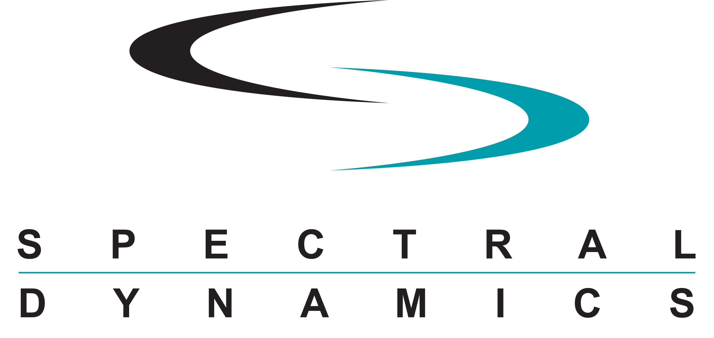

<p align="center">

</p>

---

# Spectral Dynamics Xilinx Linux Kernel 6.1 Branch

This development branch is based on the ADI Xilinx Linux v6.1 branch for peripherals that are integrated with Xilinx FPGAs with custom drivers for Spectral Dynamics Panther peripherals.

> **Based on:** [analogdevicesinc/linux](https://github.com/analogdevicesinc/linux) — ADI Xilinx Linux v6.1 branch

---

## Target Hardware

| Component | Details |
|-----------|---------|
| SoC | Xilinx Zynq-7000 (XC7Z020) |
| Board | Avnet Zedboard |
| Kernel | Linux 6.1 |
| ADC | Analog Devices AD7768EVB (8-channel) |

---

## Building the Kernel

### Prerequisites

- ARM cross-compiler: `arm-linux-gnueabihf-`
- U-Boot tools (for `mkimage`)

### Build

```bash
export ARCH=arm
export CROSS_COMPILE=arm-linux-gnueabihf-
make xilinx_zynq_defconfig
make -j2 UIMAGE_LOADADDR=0x8000 uImage
```

The output kernel image will be at:
```
arch/arm/boot/uImage
```

Copy to the Zedboard boot partition:
```bash
cp arch/arm/boot/uImage /boot/uImage
```

---

## Device Tree

The device tree source for the AD7768EVB Zedboard target is located at:

```
arch/arm/boot/dts/zynq-zed-adv7511-ad7768-axi-adc.dts
```

---

## License

This kernel is licensed under the GNU General Public License v2.
See [COPYING](COPYING) for details.